# AWS-Setup
# AWS_SetUp

## Setting up environment

* Windows OS needs to install __Babun__ (or use git bash, but Babun highly recommended).
* Mac OS or Linux just use inbuilt __Terminal__(Mac OS could use iTerm2).
* Install git

## Generate Secure Shell keypair([ssh](https://en.wikipedia.org/wiki/Secure_Shell))

### You only need to create ssh keypair once.

* Open __Terminal__(__Babun__ or windows/__Ternimal__ or __iTerm2__ on Mac).
* Type `ssh-keygen -t rsa -b 2048` and you will see:
```  
Generating public/private rsa key pair.
Enter file in which to save the key (/home/fan/.ssh/id_rsa):
```
* Just press __enter__. And you will see:
```
Created directory '/home/User/.ssh'.
Enter passphrase (empty for no passphrase):
```
* Just press __enter__. And you will see:
```
Enter same passphrase again:
```
* Press __enter__ and you will see:
```
Your identification has been saved in /home/fan/.ssh/id_rsa.
Your public key has been saved in /home/fan/.ssh/id_rsa.pub.
The key fingerprint is:
SHA256:Gso6hYqlBX5ZniCwHGcO0O1K5b1VRPSiHiI6UB8jCnI fan@fan-VirtualBox
The key's randomart image is:
+---[RSA 2048]----+
|o. .     ++      |
|.o.oo     ..     |
|=.E+o.   .. .    |
|=*.=o+. .. .     |
|+o.oB +oS        |
| o==.=.= .       |
|.=+.o . .        |
|+ .o             |
|  ..             |
+----[SHA256]-----+
``` 

## Check the ssh keypair in terminal

* Check the current directory:
```
fan@fan-VirtualBox:~$ pwd
/home/fan
```
* Change directory in `.ssh`:
```
fan@fan-VirtualBox:~$ cd .ssh
fan@fan-VirtualBox:~/.ssh$ pwd
/home/fan/.ssh
fan@fan-VirtualBox:~/.ssh$ 
```
* Check the contents:
```
fan@fan-VirtualBox:~/.ssh$ ls -la
total 16
drwx------  2 fan fan 4096 Jul  2 15:43 .
drwxr-xr-x 16 fan fan 4096 Jul  2 15:45 ..
-rw-------  1 fan fan 1679 Jul  2 15:48 id_rsa
-rw-r--r--  1 fan fan  400 Jul  2 15:48 id_rsa.pub
```
* First thing need to be done is changing the permission of the __private key__ to read only:
```
fan@fan-VirtualBox:~/.ssh$ chmod 400 id_rsa
fan@fan-VirtualBox:~/.ssh$ ls -la
total 16
drwx------  2 fan fan 4096 Jul  2 15:43 .
drwxr-xr-x 16 fan fan 4096 Jul  2 15:45 ..
-r--------  1 fan fan 1679 Jul  2 15:48 id_rsa
-rw-r--r--  1 fan fan  400 Jul  2 15:48 id_rsa.pub
```
* Print the content of __public key__:
```
fan@fan-VirtualBox:~/.ssh$ cat id_rsa.pub
ssh-rsa AAAAB3NzaC1yc2EAAAADAQABAAABAQC9Mxk6M3ApAHiM4w1SbmGwfFkEyuiUPXKrGvx9nALG3wv59iFpcGuMq
YddayOjfm/TlxeaVJbhC8Lgg7KvT0fv9BYk1aKDAYl42UsQL+SE8QE7DT+7WC/5dbkGyk7gaHesV8KLjRwwHW
76XPG7L/xCAE5s0ByEmPuy651yBXc9rr3Ys96qinQgM3l0Bu09VgCoRpN7lU9bilF+x00AY6cDsHxvJzneRFM
T4dFhn7RSed4UiIRb0wMawrZd1hMVZUQXpayMJWmwL0PfuLRIT4qPN1ktwHNRl9l/n+UJtUVfevJMiRXuQ1nq
xynk2cWMlu1FOi+SLyOQ1ImbNUvd81 fan@fan-VirtualBox
```
#### This is the ssh keypair of this computer.

## Add ssh keypair to github and AWS.

### Github

* Create a new account on [github](github.com).
* Log in and click the icon located at __top right side__.
* Click __settings__ and then click __SSH and GPG keys__.
* Click __New SSH key__.
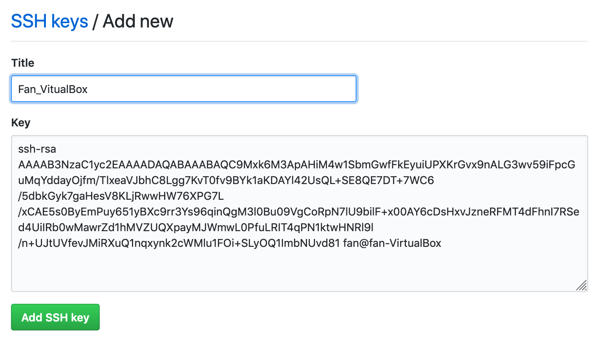
* Check the tutorial for github https://guides.github.com/activities/hello-world/

#### Connect your terminal with github.

* Install __[git](https://git-scm.com/book/en/v2/Getting-Started-Installing-Git)__
* Open a __Terminal__.
* Check __git version__(an easy way to check if git is installed or not):
```
fan@fan-VirtualBox:~$ git --version
git version 2.17.1
```
* add __git configuration__ to terminal:
```
git config --global user.name 'yourname'
git config --global user.email 'youremail'
```

* Test connection:
```
fan@fan-VirtualBox:~$ ssh -T git@github.com
Warning: Permanently added the RSA host key for IP address '192.30.253.113' to the list of known hosts.
Hi globalaiorg! You've successfully authenticated, but GitHub does not provide shell access.
```
* You should be asked connect or not once, just type __yes__ and press __enter__.


### AWS

* Create a new account on __[aws](aws.amazon.com/)__.
* Sign in to Console.
* Search __EC2__ go to EC2 Dashboard:
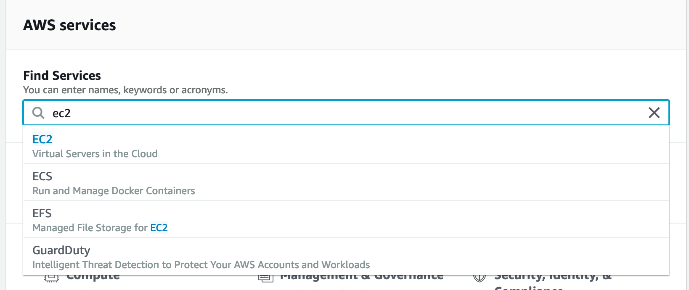

* Click __Key Pairs__:
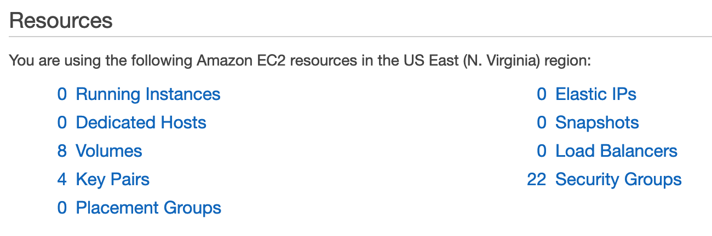

* Click __Import Key Pair__ and paste your __ssh keypair__ to __Public key contents__.
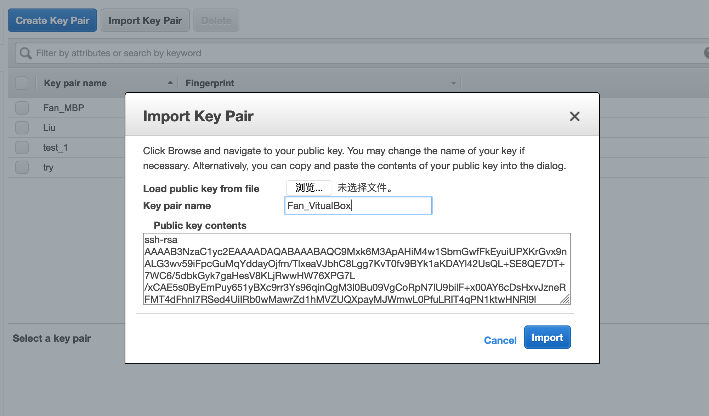

### AWS EC2 virtual machine set up

* After you adding __ssh keypair__, go to __EC2 Dashboard__.
* Click __Launch Instance__:
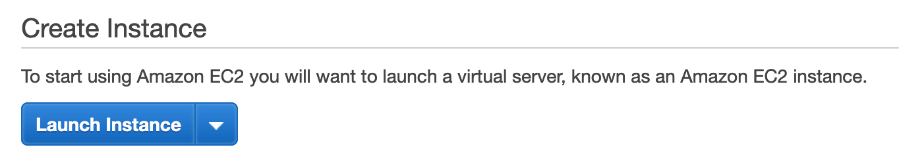

* Click __AWS Market place__ at the right side:
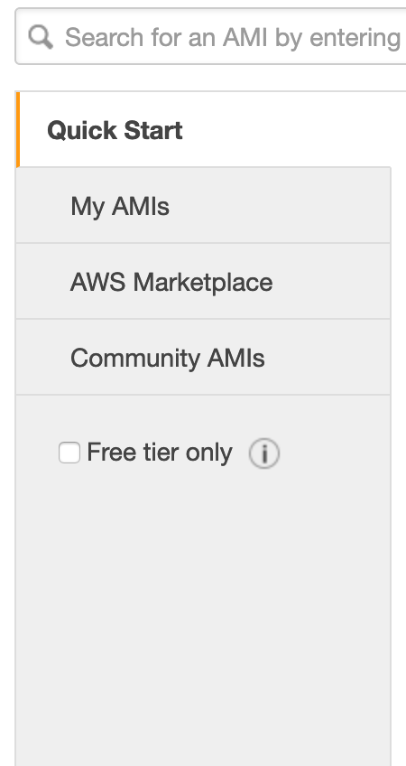

* Search __Conda__.
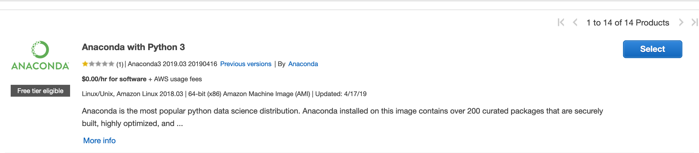

* Press __Continue__.


* Select __t2.micro__ (which should be default) and click __Next:Configure Instance Details__.
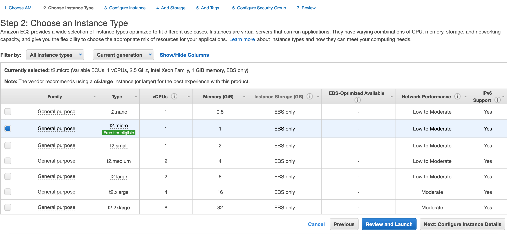

* The several following settings are some more advanced settings, usually you can just click __Add Storage__.
* Click __Add Tag__.
* Click __Next:Configure Security Group__.
* __THIS STEP IS IMPORTANT__: Change source to __Anywhere__ and click __Review and Launch__.
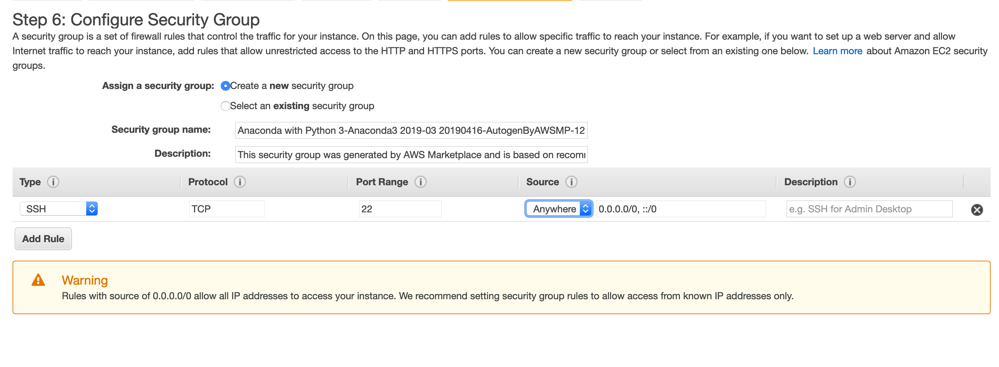

* Ignore warning and click __Launch__.
* Select your keypair(which you added in __ssh keypair step__, and click the check box(__Note: remember to select the right keypair especially when you are using Richard's account or you have several computers).__ Click __Launch__.
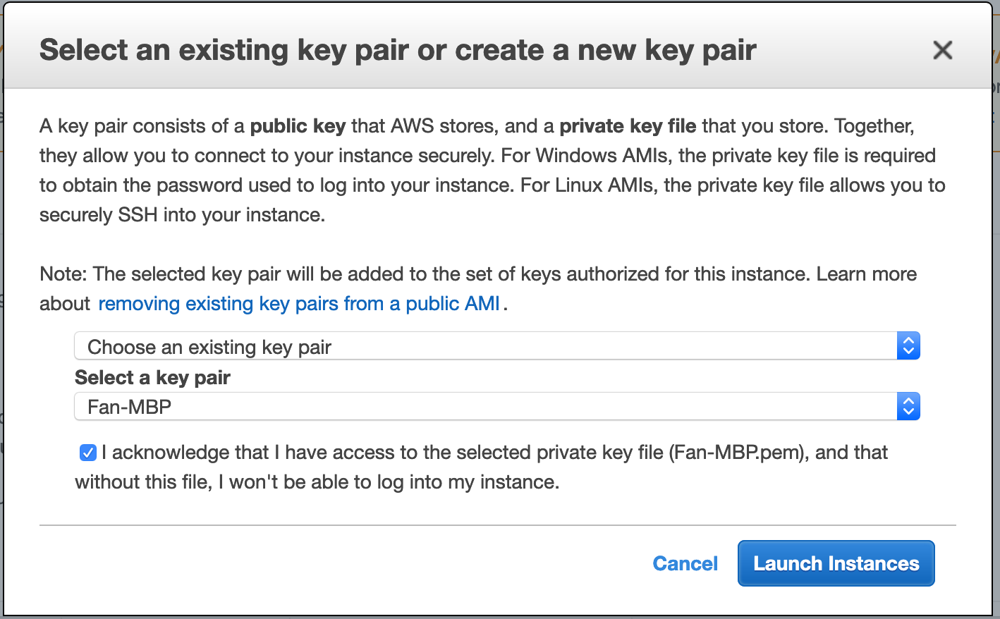

* Go to the bottom of the webpage and click __View Instance__.
* Click the __Instance__ you just created and check the information at the bottom side:
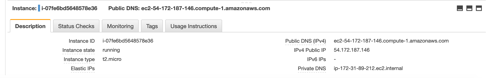

* Copy __Public DNS (IPv4)__.
* Open a __Terminal__ and type:
```
ssh-add
```
* __Note:if you are using windows do the following step, if you are using Mac or Linux ignore this step:__
```
eval `ssh-agent -s`
ssh-add
```

* Now type in the following in terminal and press __enter__.
```
ssh -A ec2-user@[paste the public DNS you just copied]
```
* My example is, you will be asked if you want to continue connecting, type in __yes__ and press __enter__:
```
FandeMacBook-Pro:~ fanliang$ ssh -A ec2-user@ec2-54-172-187-146.compute-1.amazonaws.com
The authenticity of host 'ec2-54-172-187-146.compute-1.amazonaws.com (54.172.187.146)' can't be established.
ECDSA key fingerprint is SHA256:YGwnEoB5YVo4L4PoH5w5XmrkzqMEI3XBORKyhYoVSX4.
Are you sure you want to continue connecting (yes/no)? yes 
Warning: Permanently added 'ec2-54-172-187-146.compute-1.amazonaws.com,54.172.187.146' (ECDSA) to the list of known hosts.

       __|  __|_  )
       _|  (     /   Amazon Linux AMI
      ___|\___|___|

https://aws.amazon.com/amazon-linux-ami/2018.03-release-notes/
7 package(s) needed for security, out of 8 available
Run "sudo yum update" to apply all updates.
-bash: warning: setlocale: LC_CTYPE: cannot change locale (UTF-8): No such file or directory
```
* Now you are in the __Virtual Machine__.
* Type sudo yum install -y git to install git on your machine:
```
[ec2-user@ip-172-31-89-212 ~]$ sudo yum install -y git
```
* Now you can redo the github setup process:
```
git config --global user.name 'yourname'
git config --global user.email 'your email'
ssh -T git@github.com
```

### Jupyter notebook setup

###############################################################################################

* Create a new account on __[aws](aws.amazon.com/)__.
* Sign in to Console.
* Search __EC2__ get to EC2 Dashboard:
* Search __EC2__ go to EC2 Dashboard:


* Click __Key Pairs__:
@@ -137,4 +137,21 @@ Hi globalaiorg! You've successfully authenticated, but GitHub does not provide s
* Click __Import Key Pair__ and paste your __ssh keypair__ to __Public key contents__.


### AWS EC2 virtual machine set up

* After you adding __ssh keypair__, go to __EC2 Dashboard__.
* Click __Launch Instance__.
* Click __AWS Market place__ at the right side.
* Search __Conda__.
* Press __Continue__.
* Select __t2.micro__ (which should be default) and click __Next:Configure Instance Details__.
* The several following settings are some more advanced settings, usually you can just click __Add Storate__.
* Click __Add Tag__.
* Click __Next:Configure Security Group__.
* __THIS STEP IS IMPORTANT__: Change source to __Anywhere__ and click __Review and Launch__.
* Ignore warning and click __Launch__.
* Select your keypair(which you added in __ssh keypair step__, and click the check box(__Note: remember to select the right keypair especially when you are using Richard's account or you have several computers).__ Click __Launch__.
* Go to the bottom of the webpage and click __View Instance__.

###############################################################################################

### AWS EC2 virtual machine set up

* After you adding __ssh keypair__, go to __EC2 Dashboard__.
* Click __Launch Instance__.
* Click __AWS Market place__ at the right side.
* Click __Launch Instance__:


* Click __AWS Market place__ at the right side:


* Search __Conda__.


* Press __Continue__.


* Select __t2.micro__ (which should be default) and click __Next:Configure Instance Details__.
* The several following settings are some more advanced settings, usually you can just click __Add Storate__.


* The several following settings are some more advanced settings, usually you can just click __Add Storage__.
* Click __Add Tag__.
* Click __Next:Configure Security Group__.
* __THIS STEP IS IMPORTANT__: Change source to __Anywhere__ and click __Review and Launch__.


* Ignore warning and click __Launch__.
* Select your keypair(which you added in __ssh keypair step__, and click the check box(__Note: remember to select the right keypair especially when you are using Richard's account or you have several computers).__ Click __Launch__.


* Go to the bottom of the webpage and click __View Instance__.


###############################################################################################


@@ -166,6 +166,53 @@ Hi globalaiorg! You've successfully authenticated, but GitHub does not provide s


* Go to the bottom of the webpage and click __View Instance__.
* Click the __Instance__ you just created and check the information at the bottom side:


* Copy __Public DNS (IPv4)__.
* Open a __Terminal__ and type:
```
ssh-add
```
* __Note:if you are using windows do the following step, if you are using Mac or Linux ignore this step:__
```
eval `ssh-agent -s`
ssh-add
```

* Now type in the following in terminal and press __enter__.
```
ssh -A ec2-user@[paste the public DNS you just copied]
```
* My example is, you will be asked if you want to continue connecting, type in __yes__ and press __enter__:
```
FandeMacBook-Pro:~ fanliang$ ssh -A ec2-user@ec2-54-172-187-146.compute-1.amazonaws.com
The authenticity of host 'ec2-54-172-187-146.compute-1.amazonaws.com (54.172.187.146)' can't be established.
ECDSA key fingerprint is SHA256:YGwnEoB5YVo4L4PoH5w5XmrkzqMEI3XBORKyhYoVSX4.
Are you sure you want to continue connecting (yes/no)? yes 
Warning: Permanently added 'ec2-54-172-187-146.compute-1.amazonaws.com,54.172.187.146' (ECDSA) to the list of known hosts.
       __|  __|_  )
       _|  (     /   Amazon Linux AMI
      ___|\___|___|
https://aws.amazon.com/amazon-linux-ami/2018.03-release-notes/
7 package(s) needed for security, out of 8 available
Run "sudo yum update" to apply all updates.
-bash: warning: setlocale: LC_CTYPE: cannot change locale (UTF-8): No such file or directory
```
* Now you are in the __Virtual Machine__.
* Type sudo yum install -y git to install git on your machine:
```
[ec2-user@ip-172-31-89-212 ~]$ sudo yum install -y git
```
* Now you can redo the github setup process:
```
git config --global user.name 'yourname'
git config --global user.email 'your email'
ssh -T git@github.com
```

### Jupyter notebook setup
